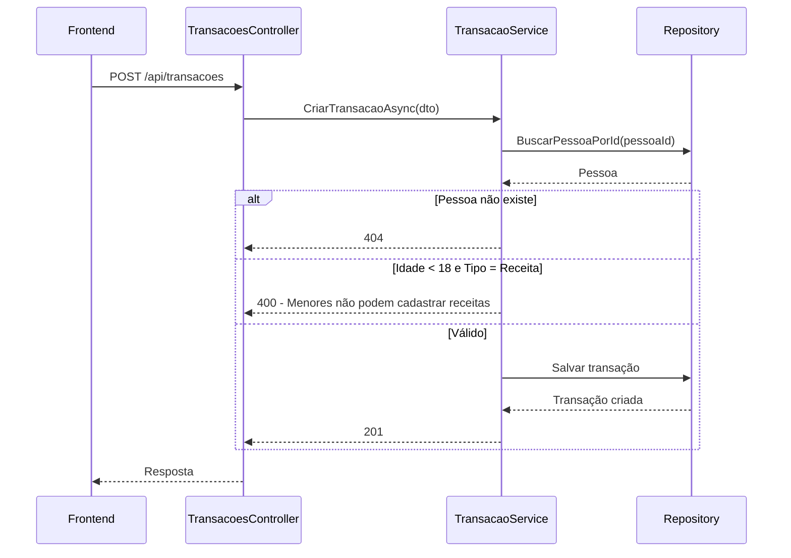
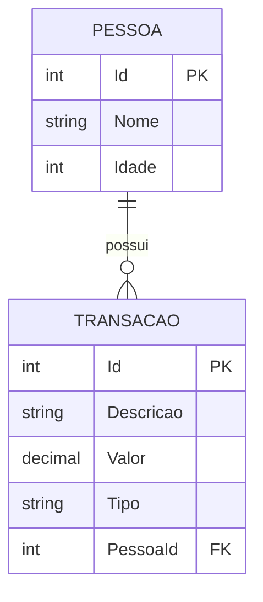

## Diagramação 
feita para melhor visualização

```mermaid
sequenceDiagram
    participant F as Frontend
    participant C as TransacoesController
    participant S as TransacaoService
    participant R as Repository

    F->>C: POST /api/transacoes
    C->>S: CriarTransacaoAsync(dto)
    S->>R: BuscarPessoaPorId(pessoaId)
    R-->>S: Pessoa

    alt Pessoa não existe
        S-->>C: 404
    else Idade < 18 e Tipo = Receita
        S-->>C: 400 - Menores não podem cadastrar receitas
    else Válido
        S->>R: Salvar transação
        R-->>S: Transação criada
        S-->>C: 201
    end

    C-->>F: Resposta
```

```mermaid
erDiagram
    PESSOA ||--o{ TRANSACAO : possui
    PESSOA {
        int Id PK
        string Nome
        int Idade
    }
    TRANSACAO {
        int Id PK
        string Descricao
        decimal Valor
        string Tipo
        int PessoaId FK
    }
```